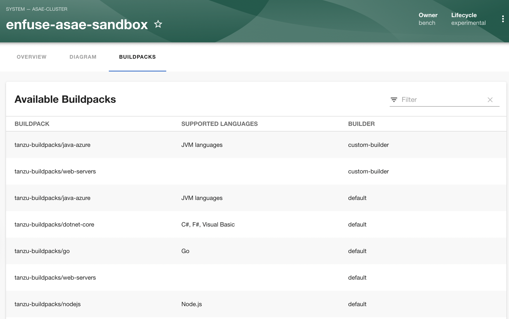
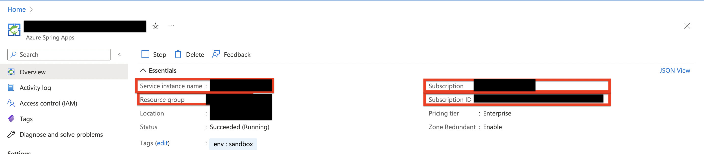

# Azure Spring Apps Enterprise (ASAE) Plugin
Welcome to the azure-spring-apps plugin!

This handy-dandy plugin will help you bring critical information from your Azure Spring Apps Enterprise cluster to Backstage! 

## Features
### Current
- Display all the builders availble to compile your applications source code. 


### In the works
- List application instances with general information and deployment status
- Ability to connect to logs from application instances.
- View configuration from different built in components (Gateway, Configuration Service, Service Registry)

# Requirements
1. An [Azure Subscription](https://azure.microsoft.com/en-us/free/)
2. An [Azure Spring Apps Enterprise Serivce](https://learn.microsoft.com/en-us/azure/spring-apps/) under your subscription
3. A [Backstage](https://backstage.io/docs/getting-started/) application instance


# Getting started

1. Download the package into the app module of your backstage project

```sh
yarn --cwd packages/app add @enfuse/plugin-spring-azure-apps
```

2. Use the plugin in your catalog page. The code below shows you how to do place it under the systemPage section, but you're free to do what your heart desires.

``` js
/*  packages/app/src/components/catalog/EntityPage.tsx  */
...
import { AzureBuildpacksPage,isAsaeBuildpacksBuilderNameAvailable } from '@enfuse/plugin-azure-spring-apps';

const systemPage = (
...
    <EntityLayout.Route 
      if={isAsaeBuildpacksBuilderNameAvailable}
       path="/azure-buildpacks" title="Azure Buildpacks">
        <AzureBuildpacksPage></AzureBuildpacksPage>
    </EntityLayout.Route>
```
### Configuration
3. The plugin fetches information using credentials and general information about where your cluster resides. You need to provide these from your backstage configuration.
You can get the general information from your overview page in your ASAE clsuter as shown below:

 You will also need to provide a tenantId and a clientId from an AD app registration. [(steps to create)](https://learn.microsoft.com/en-us/azure/active-directory/develop/quickstart-register-app). The plugin will authenticate the user in a popup window. Whoever signs in should have the appropiate permissions to interact with the resources from the Azure. 
 
 Use the following keys to setup your configuration, you can leave builServiceName as default for now

```yml
//app-config.yml or app-config-local.yml
azureBuildpacks:
  resourceGroupName: <resource-group>
  serviceName: <asae-service-name>
  buildServiceName: default
  subscriptionId: <subscription-id>
  credentials:
    tenantId: <tenant-id>
    clientId: <client-id>
```

