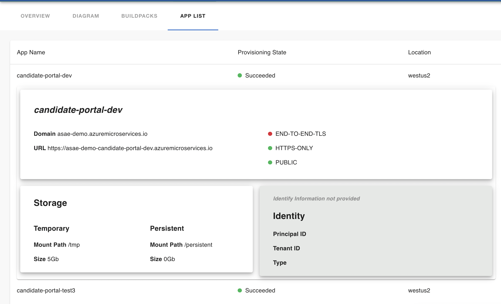
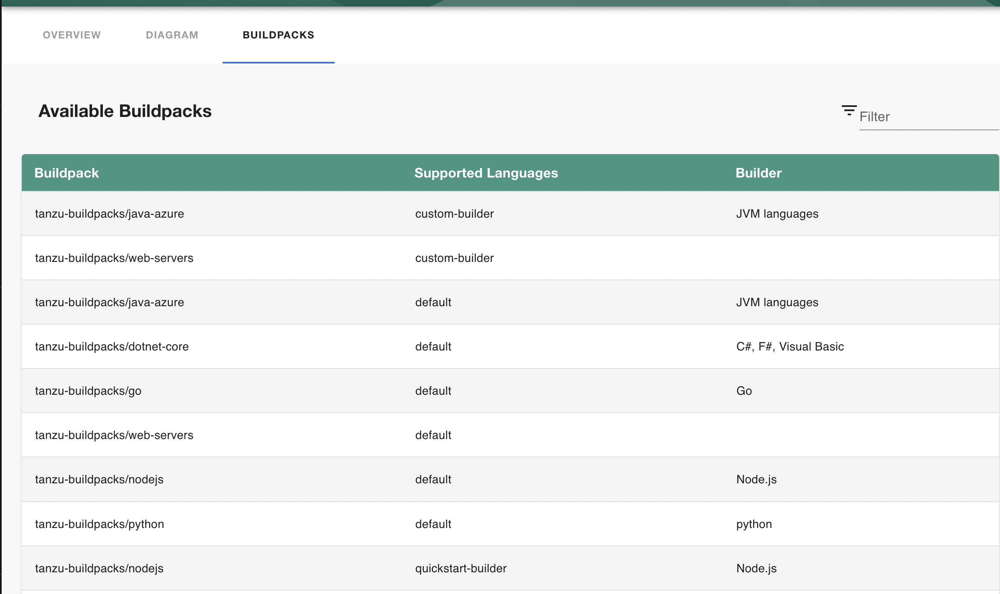

# Azure Spring Apps (ASAE) Plugin
The Azure Spring App plugin displays status and configuration information about your Azure Spring Apps  cluster to Backstage. 



> Plugin has only been tested using Enterprise tier

# Releases
## v1.1.0 -  CURRENT
- App list tab describes all apps on cluster including the identity, routing, storage and security information
## v1.0.0 
- Display all the builders available to compile your applications source code. 

# Features
* Buildpacks
  * List all build packs available on cluster for use
  * Supported languages/frameworks


* App List which displays:
  * list of apps
  * route and endpoints
  * HTTPS/Public/end-to-end TLS status
  * Temporary / Permanent Storage Location
  * Identity information (if applicable)
# Requirements
In order to use the Azure Spring Application plugin, you must have a working Azure Spring Application cluster.

1. An active [Azure Subscription](https://azure.microsoft.com/en-us/free/)
2. An [Azure Spring Apps Cluster](https://learn.microsoft.com/en-us/azure/spring-apps/) under your subscription
3. A [Backstage](https://backstage.io/docs/getting-started/) application instance

# Installation

1. Install the plugin with `yarn` in the root of your Backstage directory

```sh
yarn --cwd packages/app add @enfuse/plugin-azure-spring-apps
```

>#### Warning
>This installation method fails and leaves the application in a failing state. We found adding `@enfuse/plugin-azure-spring-apps` in the dependecies section manually and running `yarn install` adds the package without a problem

2. Import and use the plugin in your catalog page. Example code below:

``` js
/*  packages/app/src/components/catalog/EntityPage.tsx  */
...
import { AzureBuildpacksPage , AsaeAppsListPage} from '@enfuse/plugin-azure-spring-apps';

const systemPage = (
...
    //Buildpacks
    <EntityLayout.Route 
       path="/azure-buildpacks" title="Azure Buildpacks">
        <AzureBuildpacksPage></AzureBuildpacksPage>
    </EntityLayout.Route>

    //Apps List
    <EntityLayout.Route 
      path="/asae-apps-list" title="App List">
        <AsaeAppsListPage></AsaeAppsListPage>
     </EntityLayout.Route>
    // or wherever your heart desires
```
# Configuration
1. This plugin requires credential details. This should be provided in the backstage configuration as shown below:

```yml
//app-config.yml or app-config-local.yml
azureBuildpacks:
  credentials:
    tenantId: <tenant-id>
    clientId: <client-id>
```
 
> You also need to provide a tenantId and a clientId from an AD app registration in order for our app to be able to authenticate users [(guide to generate can be found here)](https://learn.microsoft.com/en-us/azure/active-directory/develop/quickstart-register-app). The plugin will authenticate the user in a popup window. Whoever signs in should have the appropriate permissions (READ) on the cluster.

## Entity
The entity you choose to represent your ASAE cluster shouold include the following anotations

```yml
//asae-entity.yml 
...
metadata:
  name: asae-entity-sample
  annotations:
    dev.azure.com/resource-group: <resource-group>
    dev.azure.com/service-name: <asae-service-name>
    dev.azure.com/build-service-name: default // this can only be default for now
    dev.azure.com/subscription-id: <subscription-id>
```

> You can find this information on the Azure Spring App cluster overview page, see screenshot below:


Build service name refers to the buils service that provided the builder, which is the Tanzu Build Service in ASAE. 